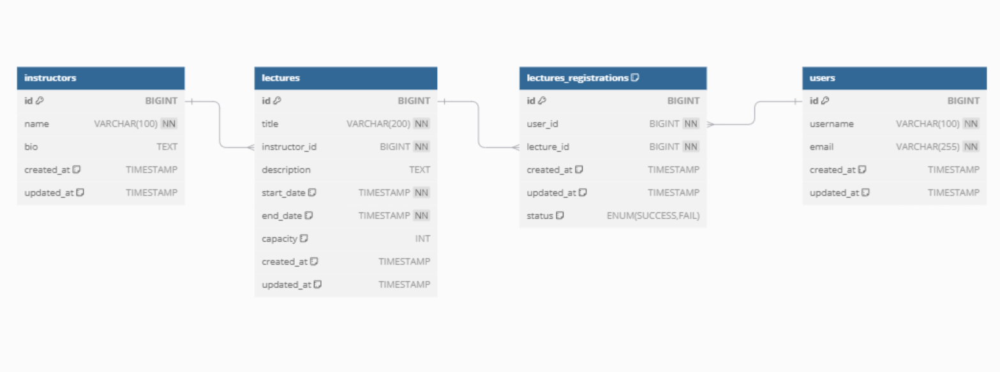

# 🌱 [항해 플러스 2주차 과제] 특강 신청 서비스

특강 신청 서비스를 구현합니다. 항해 플러스 토요일 특강을 신청할 수 있는 서비스를 개발하며, 특강 신청 및 신청자 목록 관리를 RDBMS를 이용해 관리합니다.

---

## Requirements

### 구현해야 할 API
1. **특강 신청 API**
2. **특강 신청 여부 조회 API**

### 주요 요구사항
- 각 기능 및 제약 사항에 대해 **단위 테스트를 반드시 하나 이상 작성**합니다.
- 다수의 인스턴스로 어플리케이션이 동작하더라도 기능에 문제가 없도록 작성합니다.
- **동시성 이슈**를 고려하여 구현합니다.
- **DB는 MySQL / MariaDB**로 제한합니다.
- 테스트 환경은 아래 두 가지를 허용합니다:
    - (1) **인메모리 DB**
    - (2) **docker-compose** (또는 TestContainers 사용 가능)

---

## API Specifications

### 1️⃣ 특강 신청 API (핵심) **API `POST /api/lectures/apply`**
- 특정 `userId`로 **선착순**으로 제공되는 특강을 신청합니다.
- 동일한 사용자는 동일한 강의에 대해 **한 번의 수강 신청만 성공**할 수 있습니다.
- 각 특강은 **선착순 30명**만 신청 가능합니다.
- 신청자가 **30명을 초과하면 이후 신청자는 요청 실패** 응답을 받습니다.

---

### 2️⃣ 특강 신청 가능 목록 API  **`POST /api/lectures`**
- 날짜별로 현재 신청 가능한 특강 목록을 조회하는 API입니다.
- **특강 정원은 30명으로 고정**되어 있으며, 사용자는 각 특강에 신청하기 전에 이 목록을 조회할 수 있어야 합니다.

---

### 3️⃣ 특강 신청 완료 목록 조회 API **`GET /api/lectures/{userId}/completed`**
- 특정 `userId`로 신청 완료된 특강 목록을 조회합니다.
- 응답 항목은 다음 정보를 포함해야 합니다:
    - 특강 ID
    - 특강 이름
    - 강연자 정보

---

## 테스트 및 개발 환경

- **RDBMS**: MySQL / MariaDB
- **테스트 옵션**:
    - 인메모리 DB (e.g., H2)
    - Docker-Compose
    - TestContainers
- **주요 고려사항**:
    - 동시성 이슈 방지
    - 다중 인스턴스 환경에서의 안정성 확보

---
## STEP 3

### 📒ERD 작성 작성의 당위성 여부

DB를 설계하면서 어떻게 RDB를 설계해야지 좋은 설계일까 정말 많은 시간을 고민한 것 같습니다.

**첫번째로 생각했던 RDB설계**

**두번째로 생각했던 RDB설계**

**최종적으로 생각한 RDB설계**

코치님께서 CAP이론을 말씀해주셔서 한 번 찾아보았습니다.

CAP 이론(또는 Brewer`s theorem)이란 Network로 연결된 분산된 데이터베이스 시스템은 일관성(Consistency), 가용성(Availability), and 분할 내구성(Partition Tolerance)의 3가지 특성중 2가지 특성만을 충족 할수 있고 3가지 모두 충족할 수 없다는 이론.

간략히 말하자면, "2개에 집중하고 1개는 포기하자." 였습니다.

그리고 FK를 설정하지 않은 이유에 대해서는 [외래키를 지양하라는 질문에 대한 궁금증](https://www.inflearn.com/community/questions/1109451/%EC%99%B8%EB%9E%98%ED%82%A4%EB%A5%BC-%EC%A7%80%EC%96%91%ED%95%98%EB%9D%BC%EB%8A%94-%EC%A7%88%EB%AC%B8%EC%97%90-%EB%8C%80%ED%95%9C-%EA%B6%81%EA%B8%88%EC%A6%9D?focusComment=313959)글을 참고하여 작성했습니다.

하지만 이에 반박되는 의견인 [외래키? 그거 없어도 되지 않나요?](https://gdsc-university-of-seoul.github.io/foreign-key) 이런 글도 발견할 수 있었습니다.

그래서 상충되는 의견속에 "결국 옳은 것은 없구나" 라는 결론이 도출되었고, 그렇다면 "심플하게 가자" 라는 최종적인 결론이 도출되어서 다음과 같은 데이터베이스 설계가 도출되었습니다.

---

## STEP 4

### 🔑동시성 이슈

1주차를 경험하면서 Application에서 동시성 제어인 Reentrantlock, Async

2주차를 경험하면서 Application에서 DB 제어인 낙관락, 비관락을 경험했다고 생각합니다.

하지만 이 2가지 모두 현업에서 잘 사용되지 않지만, 이 2가지를 경험하면서 간단한 문제해결에는 사용될 수 있는 방식이 있음을 배웠습니다.

### 🗺️아키텍쳐

가장 어려웠던 부분은 아키텍쳐라고 생각합니다. 이것이 가장 어려웠던 부분은 2가지의 측면이 있다고 생각합니다.

1. 확장성과 유연성에 많은 설계할 시 코드레벨⬆️ 복잡성⬆️️
2. 조금 더 낮은 확장성과 유연성으로 설계할 시 코드레벨⬇️ 복잡성⬇️

사실 한눈에 파악하기 좋은 프로젝트는 2번이지만, 여러가지를 염두하고 많은 고민을 하는 프로젝트는 1번이라는 생각이 듭니다. 
이것에 대한 답은 아직 저도 어느 곳에서도 찾지 못했습니다...

그치만, 제가 내린 결론은 주니어도 쉽게 볼 수 있는 코드를 짜고 싶었습니다... 물론 제가 코드와 패키지 구조를 잘 파악해서 작성하진 못한 것 같지만...

도메인 엔티티와 영속성 엔티티를 분리하지 않았는데, 그 이유는 [도메인 엔티티와 영속성 엔티티](https://dkswnkk.tistory.com/753) 해당 글에서 영감을 받았습니다.
저는 이 프로젝트의 요구사항을 충족시키기 위해서 같은 역할을 하는 도메인 엔티티와 영속성 엔티티를 완벽히 분리하는 것이 더욱 프로젝트를 어렵게 한다고 느꼈습니다... 조금 더 세밀한 요구사항이 주어진다면, 조금 더 세분화된 엔티티 분리를 진행하도록 하겠습니다.
